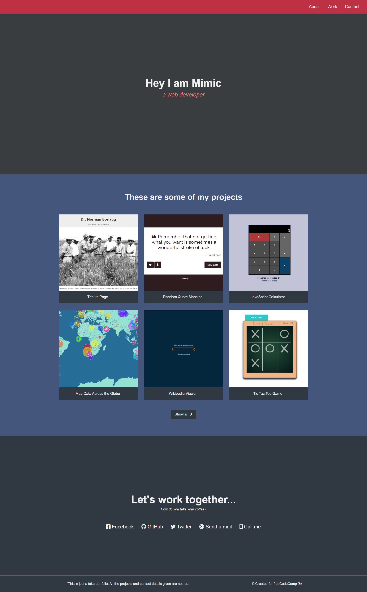

# Personal Portfolio

## 📖 Description ##

This is a personal portfolio webpage created as part of the freeCodeCamp Responsive Web Design certification.  
It showcases a selection of personal projects and includes contact information, all built with basic HTML and CSS.

## 🎯 Objectives ##

- Create a responsive layout suitable for a developer portfolio
- Display a gallery of project links with preview images or titles
- Include a navigation menu and a contact section

## 🛠️ Technologies Used ##

- HTML5
- CSS3

## 🚀 Getting Started ##

To run this project locally:

1. Clone the repository:
   git clone https://github.com/AnouGeek/personal-portfolio-freeCodeCamp.git
2. Open the folder and launch the index.html file in your browser.

## 📸 Screenshot ##

## 🪪 License ##

This project is licensed under the MIT License.